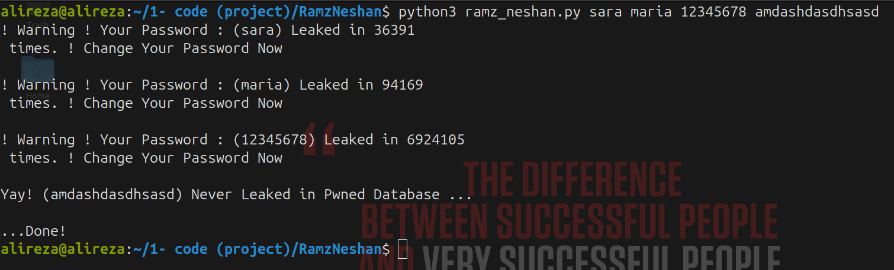

# Ramz Neshan
RamzNeshan is a cli application , it can check your password with hundreds databases was leaked in the internet to you password is hacked and leaked or not .

> Ramz Neshan, use https://haveibeenpwned.com/ , api.

### How to use ?

> you can how many password you want type in terminal and see the result

## Help to Improve This App :
> you can clone this project and work on it and push it to new branch and my sure i merge it. 
---
## Contact with me : 
- email : alirezafazeliTech@outlook.com
- X (twitter) : @fazeli_tech
- Telegram : @fazeli_tech
- Telegram Channel : @FazeliTech
- Linkedin : https://linkedin.com/in/alirezafazeli